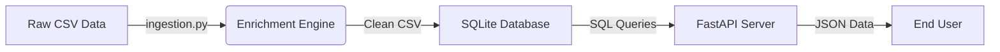

# BookFinder: University Library Enrichment System

## 📖 Introduction: The Problem & The Solution

**The Problem:**
University library datasets are often incomplete. Our raw data file (`dau_library_data.csv`) contained thousands of books with technical details (ISBN, Author, Year) but **missing descriptions**. Without a description, a library user can't know what a book is actually about.

**The Solution:**
**BookFinder** is an automated pipeline that fixes this. It acts as a "digital librarian" that:
1.  **Reads** the messy library data.
2.  **Searches** the web for missing book summaries.
3.  **Saves** the enriched data into a structured database.
4.  **Serves** the clean data to other apps via a website API.

---

## 🏗️ Architecture: How It Works

This project uses an **ETL (Extract, Transform, Load)** pipeline approach. We don't just do everything in one messy file; we separate the concerns into three distinct stages.



### 1. The "Researcher" (`ingestion.py`)

* **What it does:** This script is the "intelligence" of the system.
* **How it works:** It reads the CSV file row by row. If it finds a book with no description, it pauses, performs a Google search using the book's title and author, scrapes the result snippet, and fills in the blank.
* **Why we do this:** Manual data entry for thousands of books is impossible. Automation saves time.

### 2. The "Librarian" (`SQLite3.py`)

* **What it does:** This script handles data storage.
* **How it works:** It takes the messy text files (CSV) and moves them into a structured **Relational Database** (`db.sqlite3`).
* **Why we do this:** CSV files are slow to search and hard to manage. A database (SQL) allows us to find a specific book instantly using its ID or ISBN.

### 3. The "Receptionist" (`api.py`)

* **What it does:** This is the public face of the project.
* **How it works:** It starts a web server. When a user asks for a book (e.g., via a web browser or mobile app), this script queries the database and returns the answer in JSON format.
* **Why we do this:** We don't want users touching our raw database file. The API provides a safe, read-only "window" into our data.

---

## 🛠️ Key Technical Concepts Learned

This project demonstrates several core software engineering skills:

* **Web Scraping:** Using `BeautifulSoup` to extract information from HTML web pages.
* **Data Cleaning:** Using `Pandas` to remove duplicates and handle missing values (`NaN`).
* **Database Normalization:** Organizing data into tables with Primary Keys to prevent redundancy.
* **API Development:** Using `FastAPI` to create RESTful endpoints (GET requests).
* **Separation of Concerns:** Breaking code into smaller, single-purpose files for better maintainability.

---

## 🎯 Objectives

* Clean and standardize raw library data
* Handle duplicate and inconsistent ISBN values
* Enrich missing book descriptions using external data sources
* Merge enriched data into a single canonical dataset
* Store structured data in a relational database
* Provide REST API access to the enriched dataset

---

## 📁 Project Structure

```
BDE
|__API
   |__ api.py
|__Database
   |__ SQLite3.py
   |__ db.sqlite3
|__Data Gather
   |__ data_exploration.ipynb
   |__ dau_library_data.csv
   |__ ingestion.py
|__Data
   |__ FinalDATA.csv
   |__ dau_library_data.csv
|__ cli_helper.py
|__ example_script.py
|__ README.md
|__ requirements.txt

---

## 📋 Data Files Description

### `dau_library_data.csv`

Raw library dataset containing accession details, titles, ISBNs, authors, publishers, year, pages, and classification numbers.
This dataset contains **duplicate ISBNs** and **missing descriptions**.

### `OpenLibrary.csv`

Intermediate dataset generated using ISBN-based queries to the OpenLibrary API.
Provides partial description coverage and serves as an **early enrichment layer**.

### `GoogleBooks.csv`

Large-scale dataset obtained by extracting description-related HTML content from Google Books.
Used as a **high-coverage intermediate source** during enrichment.

### `Final_Merged_Descriptions.csv`

Final consolidated dataset created by merging all successful description sources and resolving duplicates.
This file acts as the **single source of truth** for database insertion.

### `FinalDATA.csv`

The enriched CSV file after running the ingestion script, ready for database insertion.

---

## 🔄 Data Enrichment Workflow

1. Load raw library records
2. Identify unique and missing ISBN descriptions
3. Query OpenLibrary for initial description enrichment
4. Apply Google Books-based extraction for higher coverage
5. Clean and normalize extracted text
6. Merge all successful descriptions into a unified dataset
7. Resolve duplicates and inconsistencies
8. Export final enriched dataset

The enrichment logic is implemented and documented in `Data Scrape.ipynb`.

---

## 🗄️ Database Design

**Database:** `db.sqlite3`
**Script:** `Database/SQLite3.py`

The enriched dataset is loaded into a SQLite database with the following schema:

```sql
CREATE TABLE IF NOT EXISTS books (
    Acc_Date TEXT,
    Acc_No INTEGER PRIMARY KEY,
    Title TEXT,
    ISBN TEXT,
    Author_Editor TEXT,
    Edition_Volume TEXT,
    Place_Publisher TEXT,
    Year INTEGER,
    Pages TEXT,
    Class_No TEXT,
    description TEXT
);
```

* `Acc_No` is used as the primary key
* Duplicate records are avoided using `INSERT OR IGNORE`
* All original metadata fields are preserved

---

## 🌐 API Design

The project exposes a REST API using **FastAPI** to access the enriched dataset.

**Application file:** `API/api.py`
**Database:** `Database/db.sqlite3`

### Available Endpoints

| Method | Endpoint        | Description                                 |
| ------ | --------------- | ------------------------------------------- |
| GET    | `/`             | Health check                                |
| GET    | `/books`        | Fetch books with available descriptions     |
| GET    | `/book?isbn=`   | Fetch book details using ISBN (query param) |
| GET    | `/books/{isbn}` | Fetch book details using ISBN (path param)  |

### API Characteristics

* ISBN values are normalized by removing hyphens
* Only records with non-null descriptions are returned in bulk queries
* Query limit enforced (default: 1000, max: 5000)
* Returns appropriate HTTP status codes (`404` for missing ISBNs)

---

## 🚀 How to Run This Project

Follow these steps to set up the project on your own machine.

### Prerequisites

You need **Python 3.7+** installed.

### 1. Install Dependencies

We need a few external libraries to make the magic happen.

```bash
pip install -r requirements.txt

```

Or manually:

```bash
pip install fastapi uvicorn pandas requests aiohttp tqdm beautifulsoup4

```

### 2. Step 1: Enrich the Data (The "Researcher")

Run the ingestion script. This might take a moment as it searches the web for descriptions.

```bash
python "Data Gather\ingestion.py"
```

You can customize the input/output files and scraping behavior:

```bash
python "Data Gather\ingestion.py" --input_csv "Data/dau_library_data.csv" --output_csv "Data/FinalDATA.csv" --sleep_time 2.0
```

Run `python "Data Gather\ingestion.py" --help` to see all available options.

*Output: You will see `Data/FinalDATA.csv` update as descriptions are filled in.*

### 3. Step 2: Build the Database (The "Librarian")

Move the data from CSV to SQLite.

```bash
python Database/SQLite3.py

```

*Output: A file named `Database/db.sqlite3` will appear in your folder.*

### 4. Step 3: Launch the API (The "Receptionist")

Start the server to make the data accessible.

```bash
uvicorn API.api:app --reload

```

*Output: The terminal will say `Uvicorn running on http://127.0.0.1:8000*`

### 5. Access API Documentation

```
http://127.0.0.1:8000/docs
```

---

## 🌐 Using the API

Once the server is running, open your web browser to test it.

| Goal | URL / Action |
| --- | --- |
| **Check Health** | `http://127.0.0.1:8000/` |
| **See All Books** | `http://127.0.0.1:8000/books` |
| **Find Specific Book** | `http://127.0.0.1:8000/book?isbn=9780131103627` |
| **Automatic Documentation** | `http://127.0.0.1:8000/docs` (FastAPI generates this for free!) |

---

## 📁 File Structure Overview

* `Data Gather/dau_library_data.csv` -> **The Raw Input**: The starting point.
* `Data/FinalDATA.csv` -> **The Clean Input**: The data after we cleaned it.
* `Data Gather/ingestion.py` -> **The Worker**: Does the hard work of finding descriptions.
* `Database/SQLite3.py` -> **The Storage**: Saves the work to the database.
* `API/api.py` -> **The Interface**: Lets people talk to the database.
* `Database/db.sqlite3` -> **The Vault**: The actual database file.

---

## ⚠️ Limitations & Future Improvements

To keep this project simple for evaluation, we made a few trade-offs:

1. **Search Reliability:** We use Google search snippets. Sometimes Google might return a result that isn't perfect.
2. **Speed:** Web scraping is slower than using a paid book API (like Google Books API), but this method is free.
3. **Read-Only:** Currently, the API only allows reading data (GET), not adding new books (POST).

---

## 🛠️ Technologies Used

* **Python** – Core programming language
* **Pandas** – Data cleaning, merging, preprocessing
* **Requests** – External API interactions
* **BeautifulSoup** – HTML parsing and extraction
* **SQLite** – Lightweight relational database
* **FastAPI** – REST API framework
* **Uvicorn** – ASGI server
* **Argparse** – Command-line argument parsing

---

## 📚 Learning Outcomes

This project demonstrates:

* Practical data cleaning and enrichment techniques
* Multi-source fallback strategies
* Handling inconsistent real-world metadata
* Relational database design
* API-based data access
* Command-line interface development
* End-to-end data engineering workflows

---

## 🎓 Conclusion

BookFinder takes a messy, real-world problem (incomplete data) and solves it using a structured engineering pipeline. It transforms raw text into a live, usable API service, demonstrating the full lifecycle of backend data engineering. This project focuses on **robustness, reproducibility, and practical design** rather than idealized assumptions, making it suitable for academic evaluation as well as portfolio presentation.

